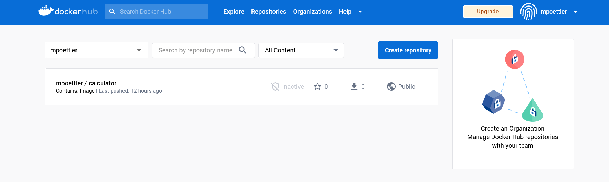

# Calculator Example 1.2 

Upgraded, tested and cleaned for Continuous Delivery Pipeline testing

## Installation

no special installation needed, currently upgraded Tools Version for 1.2
- Maven 3.8.6
- JDK 19.0.1

```bash
mvn clean
```

## Usage

```bash
mvn test
```

## Contributing

Pull requests are welcome. For major changes, please open an issue first
to discuss what you would like to change.

Please make sure to update tests as appropriate.

## License

[GNU GPLv3](https://choosealicense.com/licenses/gpl-3.0/)


# Exerciese 2

Es konnten alle schritte durchgeführt werden.Im pronzieb einfach nach dem guide nachgemacht bei kleineren fehler wie z.B einen build failure konnte durch online rechierche behoben werden.


Es Problem war es das die Javacompile Versionen nicht zusammen gepasst haben und deswegen das Dockerfile sowie den Calcultor programm geändert auf eclipse-temurin:11 .


Public Repo: https://hub.docker.com/repository/docker/mpoettler/calculator/general




